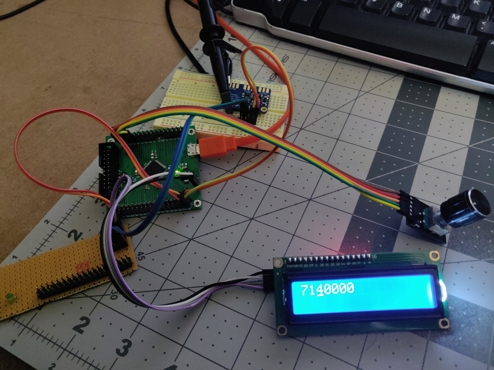
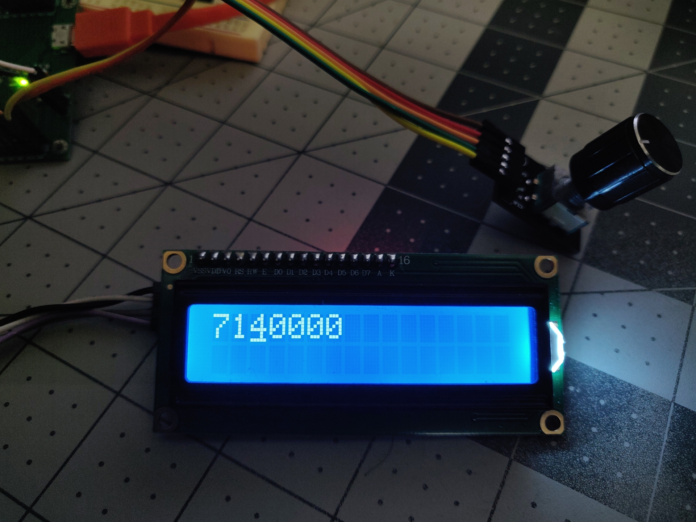
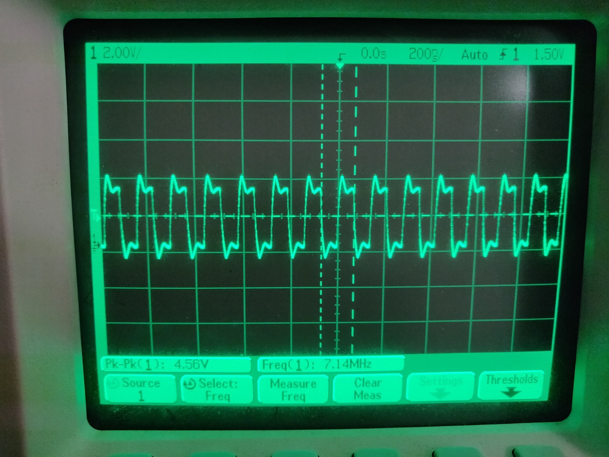

# STM32F405_VFO
This VFO is for SI5351A from Aadafruit. The controller is used here is a STM32F405.

Other useful info:
- Encoder is read using Timer 4
- Uses I2C2

Here are some pics in action. It still needs calibration and other channels to be enabled.

The LCD output and the scope

